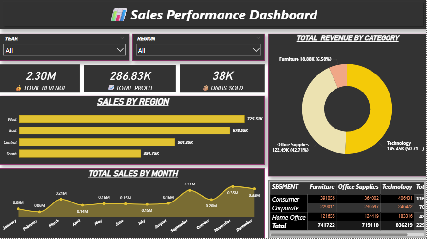

# 🛒 Sales Performance Dashboard
### *Transforming Retail Data into Actionable Business Intelligence*


---

## 📌 Project Overview

> *"Data is the new oil — but only if you refine it into insights."*

This end-to-end data analytics project analyzes **9,993 rows** of retail sales data from a US-based Superstore (2015–2018) to uncover hidden revenue patterns, identify profit leakages, and deliver strategic business recommendations that drive growth.

---

## 🎯 Business Problem Statement

A retail company was struggling to understand:

- 📍 **Which regions** are underperforming despite high sales volume?
- 📦 **Which product categories** are silently draining profits?
- 📅 **When** do sales peak and when do they drop — and why?
- 👥 **Which customer segments** offer the highest return on investment?

---

## 🛠️ Tech Stack

| Layer | Tool | Purpose |
|-------|------|---------|
| 📊 Data Preparation | Microsoft Excel | Cleaning, formatting, feature engineering |
| 🗄️ Data Analysis | SQL Server (SSMS) | Querying, aggregation, trend analysis |
| 📈 Visualization | Power BI Desktop | Interactive dashboard & storytelling |

---

## 📂 Dataset Details

| Attribute | Value |
|-----------|-------|
| 📁 Source | Superstore Sales Dataset |
| 📋 Total Records | 9,993 rows |
| 📐 Features | 17 columns |
| 🗓️ Time Period | January 2015 – December 2018 |
| 🌍 Geography | United States (4 Regions) |

---

## 🔄 Project Workflow

```
📥 Data Collection
       ↓
🧹 Data Cleaning (Excel)
       ↓
🔍 SQL Analysis (SSMS)
       ↓
📊 Power BI Dashboard
       ↓
💡 Business Recommendations
       ↓
📁 Documentation & GitHub
```

---

## 🔍 Key Findings & Insights

### 🗺️ 1. Regional Performance Analysis

| Region | Total Sales | Total Profit | Profit Margin |
|--------|------------|--------------|---------------|
| 🥇 West | $725,457 | $108,418 | 14.94% |
| 🥈 East | $678,499 | $91,534 | 13.49% |
| 🥉 South | $391,721 | $47,169 | 12.04% |
| ⚠️ Central | $501,239 | $39,706 | **7.92%** |

> **Critical Finding:** Central region generates $500K+ in sales but only 7.92% profit margin — lowest across all regions due to excessive discounting.

---

### 📦 2. Category Performance Analysis

| Category | Revenue | Profit | Margin | Units Sold |
|----------|---------|--------|--------|------------|
| 💻 Technology | $836,154 | $145,454 | 17.4% | 6,939 |
| 🖊️ Office Supplies | $719,047 | $122,490 | 17.04% | 22,906 |
| 🪑 Furniture | $741,718 | $18,883 | **2.55%** | 8,026 |

> **Critical Finding:** Furniture generates $741K revenue but only 2.55% margin — nearly a loss-making category despite high sales volume.

---

### 📅 3. Monthly Sales Trend (2015–2018)

```
Peak Months   🔥 → September | November | December
Slow Months   ❄️ → January   | February
```

| Year | Annual Revenue | YoY Growth |
|------|---------------|------------|
| 2015 | $484,247 | — |
| 2016 | $470,532 | -2.8% |
| 2017 | $608,473 | +29.3% |
| 2018 | $733,215 | +20.5% |

> **Trend Finding:** Business grew nearly 2x from 2015 to 2018. Q4 consistently drives 40%+ of annual revenue.

---

### 👥 4. Customer Segment Analysis

| Segment | Customers | Revenue | Profit | Margin |
|---------|-----------|---------|--------|--------|
| 🏠 Home Office | 148 | $429,371 | $60,310 | **14.05%** |
| 🏢 Corporate | 236 | $706,146 | $92,399 | 13.08% |
| 🛒 Consumer | 409 | $1,161,401 | $134,119 | 11.55% |

> **Key Insight:** Home Office segment has fewest customers but highest profit margin at 14.05% — a highly underserved, high-value segment.

---

## 💡 Strategic Business Recommendations

### 📌 Recommendation 1 — Central Region Discount Optimization
**Problem:** 7.92% profit margin (industry average: 12–15%)
**Action:** Implement maximum 15% discount cap in Central Region
**Expected Impact:** +5% margin improvement within 2 quarters

---

### 📌 Recommendation 2 — Furniture Category Restructuring
**Problem:** 2.55% margin despite $741K in revenue
**Action:** Reduce furniture discounts below 10% | Focus on premium SKUs
**Expected Impact:** +8% profitability in Furniture category

---

### 📌 Recommendation 3 — Seasonal Revenue Strategy
**Problem:** January–February consistently underperform
**Action:** Launch "New Year Sale" campaigns | Increase Q4 inventory by 20%
**Expected Impact:** +12% Q1 revenue boost

---

### 📌 Recommendation 4 — Home Office Segment Expansion
**Problem:** Only 148 customers despite highest 14.05% margin
**Action:** Targeted marketing campaigns | Home Office product bundles
**Expected Impact:** 20% segment growth while maintaining premium margins

---

## 📊 Dashboard Preview

> 📸 *Power BI Interactive Dashboard — featuring KPI Cards, Regional Bar Chart, Category Donut Chart, Monthly Trend Line, and Segment Matrix with Year & Region Slicers*



---

## 📁 Repository Structure

```
📦 Sales-Performance-Dashboard
 ┣ 📊 Salesstore_dataset_original_sheet.csv    → Raw Superstore data
 ┣ 📋 salesrstore_cleaned_dataset.xlsx    → Cleaned & processed data
 ┣ 📄 salesstore_csv_file.csv             → CSV version of cleaned data
 ┣ 🗄️ salessstore_modeling.sql           → All SQL queries & analysis
 ┣ 📈 Superstore_sales_dashboard.pbix     → Power BI dashboard file
 ┣ 💡 Business_recommendations.txt        → Strategic recommendations
 ┗ 📖 README.md                           → Project documentation
```

---

## 🧠 Skills Demonstrated

```
✅ Data Cleaning & Preprocessing     ✅ SQL Querying & Aggregation
✅ Exploratory Data Analysis          ✅ Data Visualization
✅ KPI Design & Dashboard Building    ✅ Business Storytelling
✅ Insight Generation                 ✅ Strategic Recommendations
```

---

## 📈 Business Impact Summary

| Problem Identified | Recommendation | Expected ROI |
|-------------------|---------------|-------------|
| Central region 7.92% margin | Discount cap policy | +5% margin |
| Furniture near-loss 2.55% | Premium product focus | +8% profit |
| Q1 seasonal slowdown | Promotional campaigns | +12% revenue |
| Home Office underserved | Targeted expansion | +20% growth |

---

## 👩‍💻 About the Author

<table>
<tr>
<td>

**Supriya Dixit**
*Aspiring Data Analyst*

📊 Excel | 🗄️ SQL | 📈 Power BI | 🐍 Python | 📉 Statistics

🎯 Passionate about transforming raw data into strategic business insights

</td>
</tr>
</table>

📧 **Email:** [supriyadixit020@gmmail.com]
🔗 **LinkedIn:** [https://www.linkedin.com/in/supriya-dixit-869786397/]
🐙 **GitHub:** [https://github.com/supriyadixit020-creator]

---

## ⭐ Support This Project

If you found this project insightful or helpful:

```
🌟 Star this repository
🍴 Fork it for your own learning
💬 Share feedback via Issues
```

---

<div align="center">

*Made with ❤️ and lots of data by Supriya Dixit*


